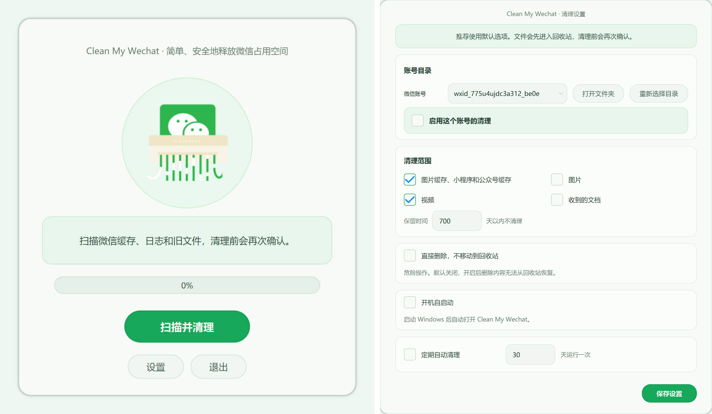
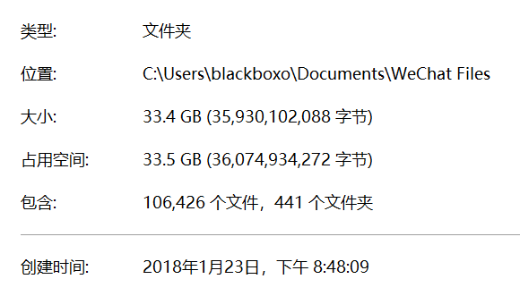

# Clean My PC WeChat


[](https://github.com/blackboxo/AutoDeleteFileOnPCWechat/releases) [](https://github.com/blackboxo/AutoDeleteFileOnPCWechat/releases) [](https://github.com/blackboxo/AutoDeleteFileOnPCWechat/releases)

<a href="https://hellogithub.com/repository/372422c3479e496aabd39ee17d56b5ba" target="_blank"></a>

自动删除 PC 端微信自动下载的大量文件、视频、图片等数据内容，解放一年几十 G 的空间占用。

该工具不会删除文字的聊天记录，请放心使用。请给个 **Star** 吧，非常感谢！

**现已经支持 Windows 系统中的所有微信版本，包含最新版的微信 4.0+ 和企业微信。**

> macOS 支持仍处于实验阶段：当前提供扫描统计、历史结果加载、增量对比、重复大文件检查、符号链接整理视图和清理前预览。执行清理时默认移动到系统回收站，不做永久删除。

[国内地址 - 点击下载](
https://wwbie.lanzoue.com/iHgXp3ql84ng)

[Github Release - 点击下载](
https://github.com/blackboxo/CleanMyWechat/releases/download/v2.1/CleanMyWechat.zip)

## 特性
1. 自动识别所有微信及企业微信账号；
2. 自由设置想要删除的文件类型，包括文件、图片、视频；
3. 自由设置需要删除的文件的距离时间，默认 365 天；
4. 删除后的文件放置在回收站中，检查后自行清空，防止删错需要的文件；
5. 支持定期自动清理；

## macOS 实验版

macOS 微信 4.x 的本地文件通常位于：

```text
~/Library/Containers/com.tencent.xinWeChat/Data/Documents/xwechat_files
```

企业微信 macOS 版常见数据目录也会尝试识别，例如：

```text
~/Library/Containers/com.tencent.WeWorkMac/Data/Documents/WXWork/Users
~/Library/Containers/com.tencent.WeWorkMac/Data/Documents/WeWork/Users
```

本仓库提供一个独立的 macOS 入口，先覆盖原项目能力，再提供 Dashboard 增强：自动识别微信/企业微信账号，按文件类型和保留天数生成清理预览，确认后移动到系统回收站，并支持定期清理检查。图形界面和命令行扫描都会显示带时间戳的进度。

macOS 功能对齐：

- 自动识别账号：支持 macOS 微信 `xwechat_files` 账号目录，并尝试识别企业微信 `WXWork/WeWork` 用户目录；
- 文件类型选择：清理预览支持图片、视频、普通文件、缓存四类开关；
- 时间范围：默认保留 365 天以内内容，支持自定义保留天数；
- 回收站：确认后通过 `send2trash` 移动到系统回收站，不提供永久删除入口；
- 定期清理：图形界面可开启定期清理检查，到期后先生成预览并要求确认。

安装依赖：

```bash
python3 -m venv .venv
source .venv/bin/activate
pip install -r requirements.txt
```

运行图形界面：

```bash
python3 macos_app.py
```

或直接生成 Dashboard：

```bash
python3 macos_scan.py
```

如果要和上一次扫描做增量对比：

```bash
python3 macos_scan.py --previous-scan ~/Documents/CleanMyWechat-macOS/reports/macos_wechat_scan_YYYYMMDD_HHMMSS_ffffff.json
```

本地打包为 `.app`：

```bash
pyinstaller --windowed --name CleanMyWechat-macOS macos_app.py
```

生成结果默认位于：

```text
~/Documents/CleanMyWechat-macOS
```

包含：

- `dashboard/wechat_dashboard.html`：本地静态 Dashboard，可按类型、月份、大小搜索和筛选；
- `organized_view/`：按月份、类型、大文件创建的符号链接视图；
- `reports/`：JSON、CSV、Markdown 扫描报告，以及 `scan_history.json` 历史索引。

安全说明：

- 扫描、Dashboard、历史加载和整理视图不会删除、不移动、不改名任何微信文件；
- 图形界面的“候选清理”需要先生成预览并再次确认，确认后移动到系统回收站；
- `organized_view/` 只包含符号链接，删除链接不会删除微信原文件；
- `db_storage`、`config`、`business/favorite` 等运行数据只统计，不纳入整理视图；
- 如需释放空间，建议先从 Dashboard 或候选清理预览中确认大文件和重复文件。

## 运行截图



## 微信现状

下载两年时间，微信一个软件就占用多达 33.5 G 存储空间。其中大部分都是与自己无关的各大群聊中的文件、视频、图片等内容，且很久以前的文件仍旧存在电脑中。



## Star History

[](https://star-history.com/#blackboxo/CleanMyWechat&Date)
